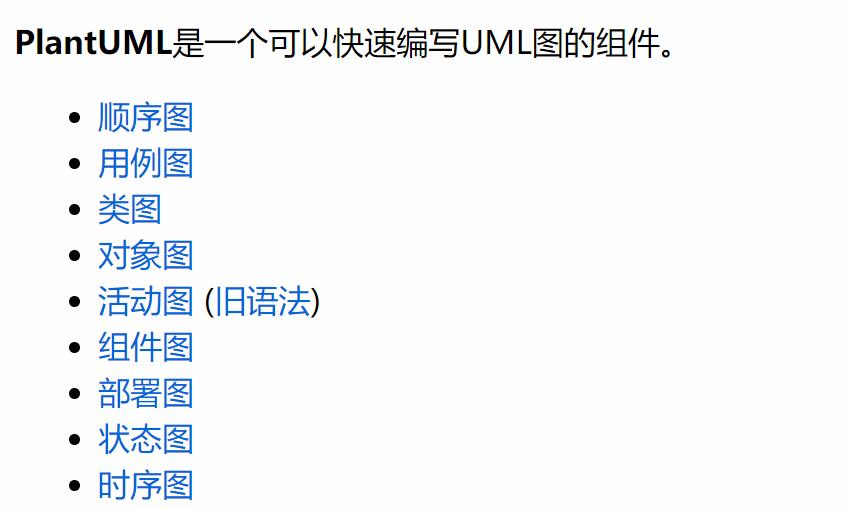

# plantuml使用说明

plantuml是一个开源的，用代码来画uml图的组件。用plantuml来画uml图，非常的方便，逻辑性非常强，也不用依赖于那些付费的uml软件。plantuml在vscode、语雀中都有良好的支持，可以将它的代码嵌在markdown文档中，多用于项目的详细设计。

## 在vscode中使用

1. 在系统中安装java，并且确保java程序配在了PATH环境变量中
2. 在vscode的市场中安装PlantUml插件
3. 在vscode的市场中安装Markdown Preview Enhanced插件
即可在vscode中编写plantuml语言文档以及在markdown中添加plantuml代码块时预览

## 基本语法

plantuml支持uml中的很多种图，具体每种图中有很多的组件，用法见[官网文档](https://plantuml.com/zh/)

