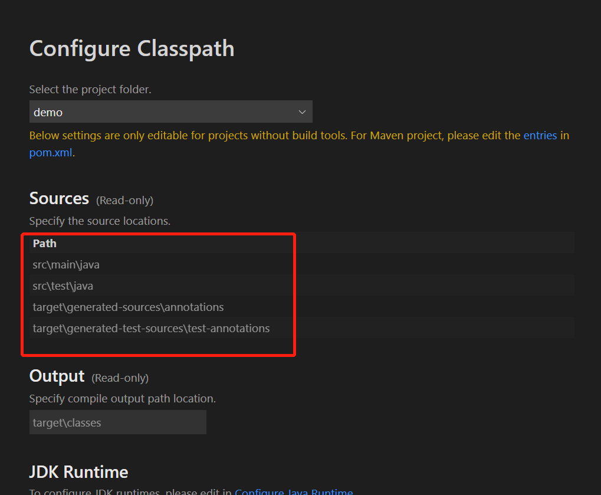

# vscode导入maven项目的问题

使用vscode导入maven项目时，经常出现无法识别java项目结构的情况，从而无法编译项目。  
其原因是项目中的代码结构不是maven默认的配置，maven默认有四个路径，配置在build标签中的，默认是

``` xml
<build>
    <sourceDirectory>src/main/java</sourceDirectory>
    <testSourceDirectory>src/test/java</testSourceDirectory>
    <outputDirectory>target/classes</outputDirectory>
    <testOutputDirectory>target/test-classes</testOutputDirectory>
</build>
```

故maven项目结构默认必须和这个一样，如果不一样需要显式地在pom.xml中修改。

在vscode的classpath configuration中也可以看到默认路径  

