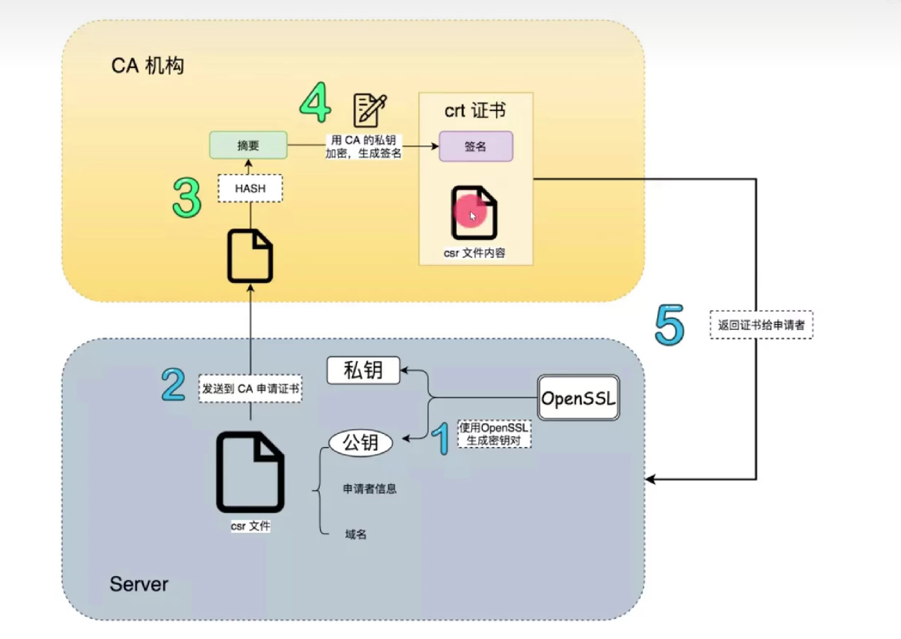

# 自签名证书的原理与使用

## 什么是非对称加密

通过算法生成私钥和公钥两个字符串，分发给A、B两者，A使用私钥加密内容，B可以使用私钥解密内容，B使用私钥加密内容，A也可以使用公钥解密内容。非对称加密的安全性很高，但是加密解密效率不高。一般用于传输对称加密的密码。

## 什么是证书

当客户端要访问某个服务器的时候，需要确保服务器不是中间人伪造的，就通过服务器上的证书来验证。如何确保该证书是真实的呢？就要找双方都信任的证书授权中心，叫CA（Certificate Authority）。CA把服务器信息加密后的文件就叫证书。

## 认证流程

* CA的公钥是以可信方式获得的，比如系统安装，手动安装等，这叫根证书
* 服务器申请证书时，将服务器信息及服务器的公钥用根证书的私钥加密，发送给CA机构
* CA机构用私钥解密服务器信息，再用私钥加密服务器信息，返回给服务器
* 客户端访问服务器时，服务器发送已签名的服务器证书给客户端
* 客户端使用CA的公钥对服务器进行解密，获得服务器的公钥
* 客户端使用服务器的公钥和服务器进行通信，获取后续请求的对称加密的密码
* 后续请求使用该密码进行

## 自签名证书

在普通的证书颁发流程中，需要整个互联网都信任的CA机构来生成证书。而在内网中，可以由自己网络中指定的对象担任CA的角色，也可以是服务器自己。这种就叫自签名证书。

## 根证书

CA机构根据自身的信息加密生成的证书。电脑里的CA根证书都是安装系统时就加进来了，因为这样才能保证证书来源可信

## openssl自签名证书使用方法

* 