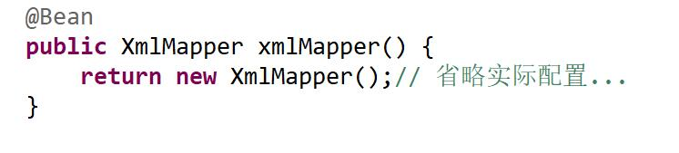
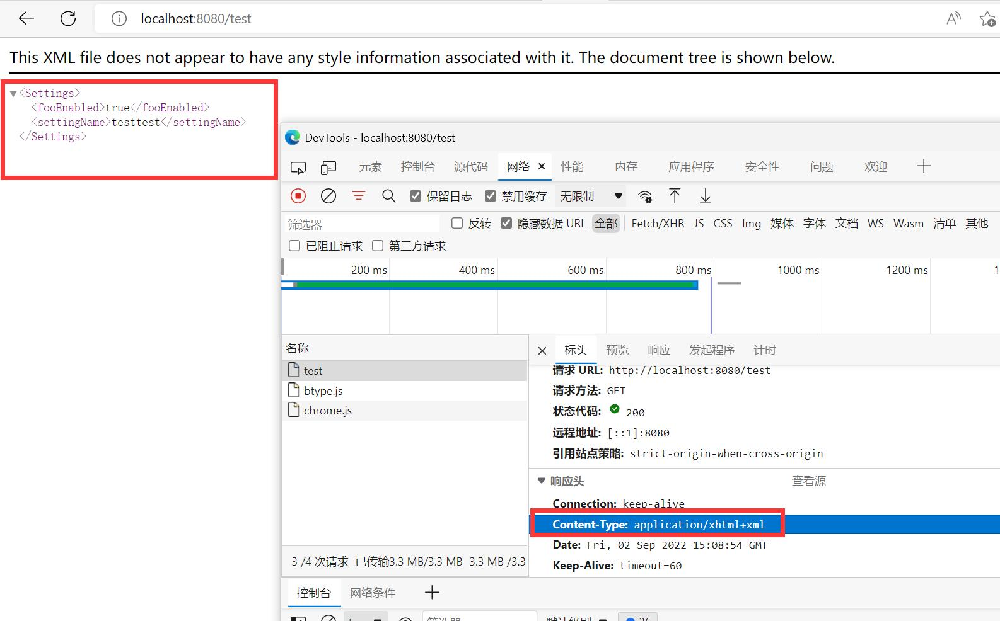
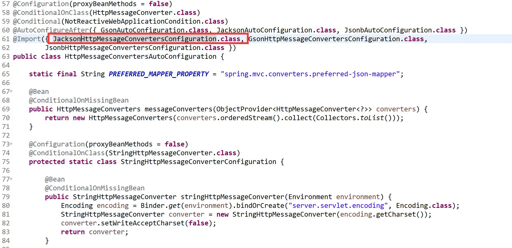
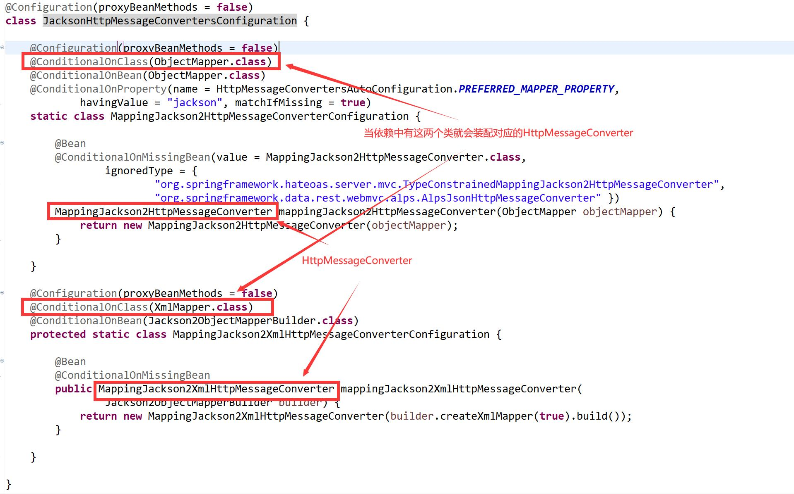
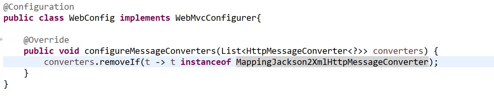
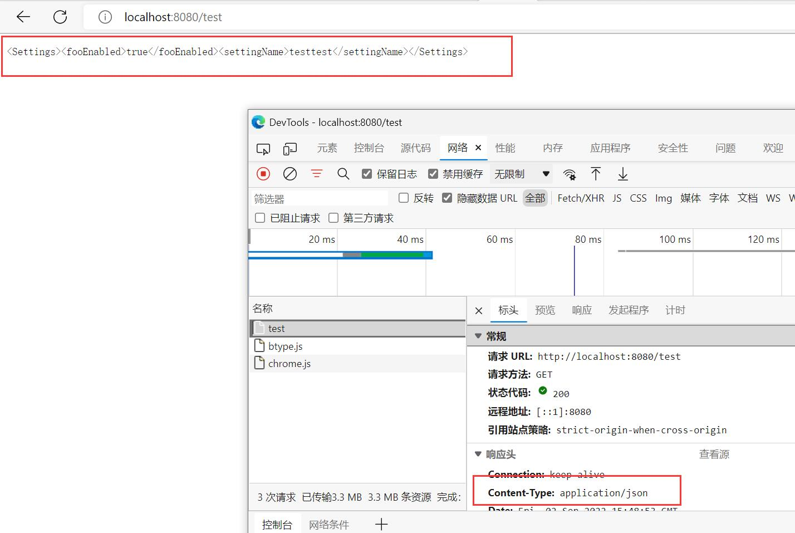
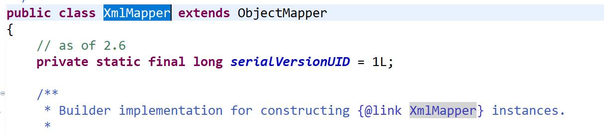
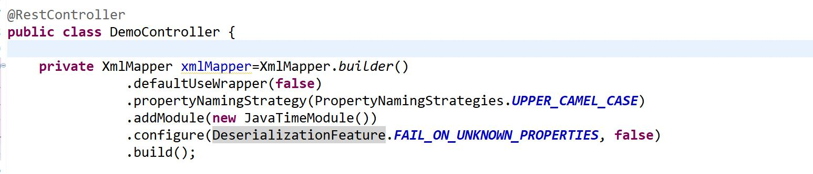
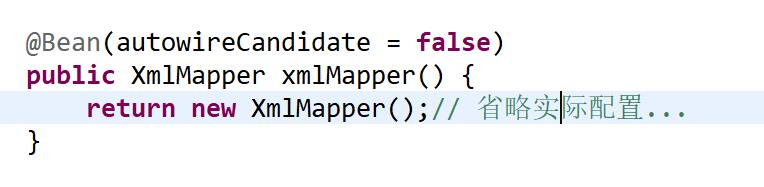

# spring boot web项目中使用xml和java对象转换工具的坑

在spring boot的web项目中，需要用到xml转换为java对象的工具。经过筛选，选择了jackson的xml转换工具`XmlMapper`。

但是使用的过程中发现，一旦加了该工具的依赖后

``` xml
<dependency>
    <groupId>com.fasterxml.jackson.dataformat</groupId>
    <artifactId>jackson-dataformat-xml</artifactId>
</dependency>
```

原本spring mvc的json响应，变成了xml格式，并且http响应的`Content-Type`也由`application/json`变为了xml相关的`application/xhtml+xml`  

这样对项目造成了很大的影响，需要改回原来的json响应。

## 出现原因

controller的响应内容，是受`HttpMessageConverter`控制的。spring boot中会默认设置很多个HttpMessageConverter，其中就包含了将对象解析为json的`MappingJackson2HttpMessageConverter`和将对象解析为xml的`MappingJackson2XmlHttpMessageConverter`。生成这两个HttpMessageConverter的地方是`HttpMessageConvertersAutoConfiguration`

这个自动配置类引入了`JacksonHttpMessageConvertersConfiguration`，而这个类中，就有写明装配上面那两个HttpMessageConverter的条件

所以当我们引入jackson-dataformat-xml依赖的时候，就一定会自动装配MappingJackson2XmlHttpMessageConverter，不管我们有没有使用该依赖。  
## 初步解决方案

所以我们只要在spring mvc的配置中去掉该HttpMessageConverter，是不是就可以解决了

再访问controller，发现还是不对

Content-Type是json了，但是内容还是xml，HttpMessageConverter的转换还是有问题。

## 再探究竟

回到配置MappingJackson2HttpMessageConverter的地方，又发现了端倪。 

controller的对象返回值转换为真正的http响应数据时，使用的是MappingJackson2HttpMessageConverter中的`ObjectMapper`，而该ObjectMapper是构造函数传进来的。该类有一个子类，正是我们要使用的XmlMapper这个工具！

这下真相大白了，因为我们注册了一个XmlMapper对象到spring容器中，所以在构造MappingJackson2HttpMessageConverter时，给它的是一个将对象转换为xml的XmlMapper。


所以controller返回时虽然使用的是MappingJackson2HttpMessageConverter，但把对象转换成了xml字符串。

## 根本解决办法

引入jackson-dataformat-xml依赖的同时，在WebMvcConfigurer中去掉MappingJackson2XmlHttpMessageConverter。

同时不要把XmlMapper注册进spring容器，在使用的类里面单独初始化后用。


## 解决问题路上的其他收获

我试图在XmlMapper设置@Bean注解的autowireCandidate为false，来取消这个bean的自动注入，以避免被自动配置类探测到从而生成xml相关HttpMessageConverter。

但是不行，因为MappingJackson2XmlHttpMessageConverter装配的条件是`@ConditionalOnClass(XmlMapper.class)`，只要有XmlMapper的反射类存在，就会装配，和容器中有没有bean无关。并且装配MappingJackson2HttpMessageConverter时，使用的并不是@Autowired方式，所以还是会装入容器中的XmlMapper。